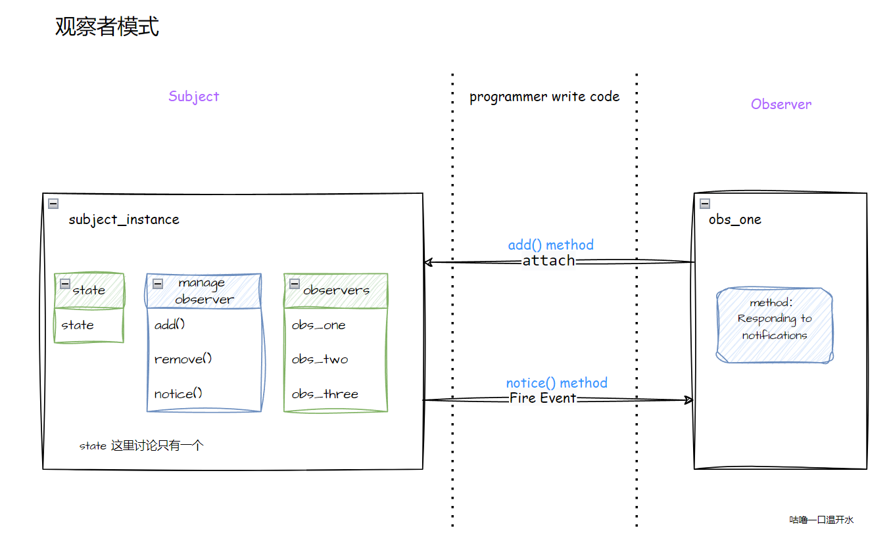

## 观察者模式

观察者模式是一种行为型设计模式，它定义了一种一对多的依赖关系，当一个对象的状态发生改变时，其所有依赖者都会收到通知并自动更新。


**观察者模式包含以下几个核心角色：**

- 主题（Subject）：也称为被观察者或可观察者，它是具有状态的对象，并维护着一个观察者列表。主题提供了添加、删除和通知观察者的方法。
- 观察者（Observer）：观察者是接收主题通知的对象。观察者需要实现一个更新方法，当收到主题的通知时，调用该方法进行更新操作。
- 具体主题（Concrete Subject）：具体主题是主题的具体实现类。它维护着观察者列表，并在状态发生改变时通知观察者。
- 具体观察者（Concrete Observer）：具体观察者是观察者的具体实现类。它实现了更新方法，定义了在收到主题通知时需要执行的具体操作。

观察者模式通过将主题和观察者解耦，实现了对象之间的松耦合。当主题的状态发生改变时，所有依赖于它的观察者都会收到通知并进行相应的更新。




```javascript
// 目标者类
class Subject {
  constructor() {
    this.observers = [];  // 观察者列表
  }
  // 添加
  add(observer) {
    this.observers.push(observer);
  }
  // 删除
  remove(observer) {
    let idx = this.observers.findIndex(item => item === observer);
    idx > -1 && this.observers.splice(idx, 1);
  }
  // 通知
  notify() {
    for (let observer of this.observers) {
      observer.update();
    }
  }
}

// 观察者类
class Observer {
  constructor(cb) {
      this.cb = cb;
  }
  // 目标对象更新时触发的回调
  update() {
    console.log(`目标者通知我更新了，`);
    this.cb();
  }
}

/*------------------- programmer write code -------------------*/
// 实例化目标者
let subject = new Subject();
// 实例化两个观察者，传入事件出发后需要执行的操作
let obs_one = new Observer(()=>{console.log('obs_one得知了，并执行某个操作')});
let obs_two = new Observer(()=>{console.log('obs_two得知了，并执行某个操作')});
// 向目标者添加观察者
subject.add(obs_one);
subject.add(obs_two);


// 目标者通知更新
subject.notify();  
// 输出：
// 目标者通知我更新了，obs_one得知了，并执行某个操作
// 目标者通知我更新了，obs_two得知了，并执行某个操作
```


**不完美**

观察者模式虽然实现了对象间依赖关系的低耦合，但却不能对事件通知进行细分管控，如 “筛选通知”，“指定主题事件通知” 。

上例中，两个观察者接收目标者状态变更通知后，都执行了 `update()`，并无区分。如何仅通知 `obs_one`？观察者对象如何只接收自己需要的更新通知？


这就引出我们的下一个模式。进阶版的观察者模式。“发布订阅模式”，部分文章对两者是否一样都存在争议。

仅代表个人观点：两种模式很类似，但是还是略有不同，就是多了个第三者，因 JavaScript 非正规面向对象语言，且函数回调编程的特点，使得 “发布订阅模式” 在 JavaScript 中代码实现可等同为 “观察模式”。


https://segmentfault.com/a/1190000019722065


```javascript
// 目标者类
class Subject {
  constructor() {
    this.observers = [];  // 观察者列表
  }
  // 添加
  add(observer) {
    this.observers.push(observer);
  }
  // 删除
  remove(observer) {
    let idx = this.observers.findIndex(item => item === observer);
    idx > -1 && this.observers.splice(idx, 1);
  }
  // 通知
  notify() {
    for (let observer of this.observers) {
      observer.update();
    }
  }
}
class MouseSubject{
    constructor(){
        this.subjects = {};
        this.eventTypeList = ['leftClick','rightClick','leftDoubleClick','middleClick'];
        this.addSubjects();
    }
    addSubjects(){
        this.eventTypeList.forEach((eventType)=>{
            this.subjects[eventType] = new Subject();
        });
    }
    add(eventType,observer){
        this.subjects[eventType].add(observer);
    }
    notify(eventType){
        this.subjects[eventType].notify();
    }
}

// 观察者类
class Observer {
  constructor(cb) {
      this.cb = cb;
  }
  // 目标对象更新时触发的回调
  update() {
    console.log(`目标者通知我更新了，`);
    this.cb();
  }
}

// programmer write code
let mouseSubject = new MouseSubject();
// 实例化两个观察者，传入事件出发后需要执行的操作
let obs_one = new Observer(()=>{console.log('obs_one leftClick')});
let obs_two = new Observer(()=>{console.log('obs_two rightClick')});
// 向目标者添加观察者
mouseSubject.add('leftClick',obs_one);
mouseSubject.add('rightClick',obs_two);


// 目标者通知更新
mouseSubject.notify('leftClick');
mouseSubject.notify('rightClick');
// 输出：
```

