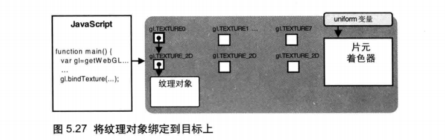
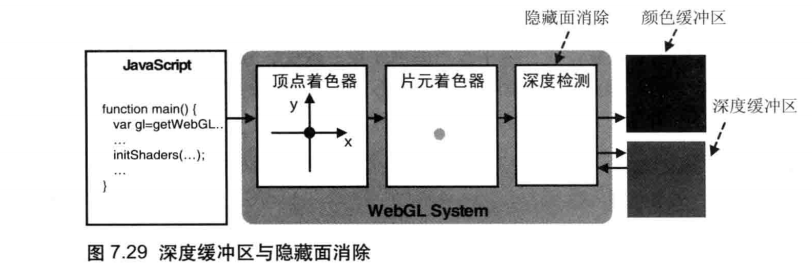
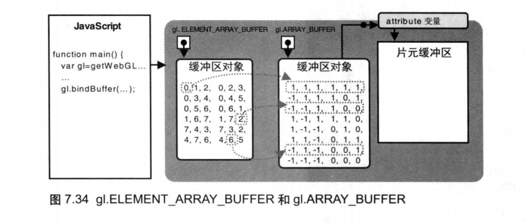
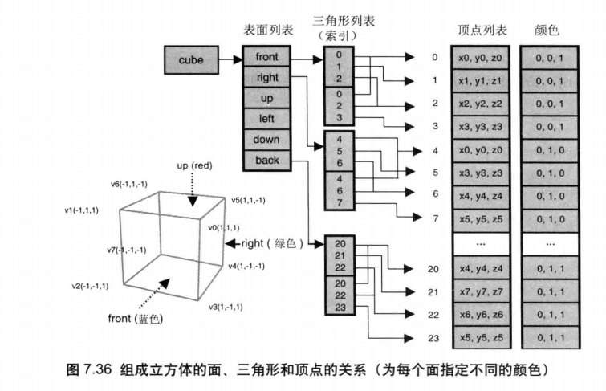
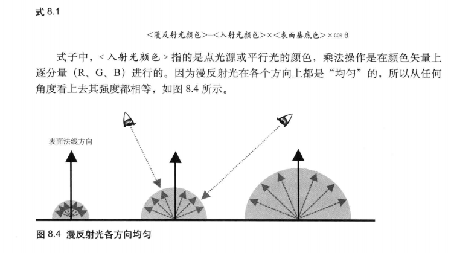
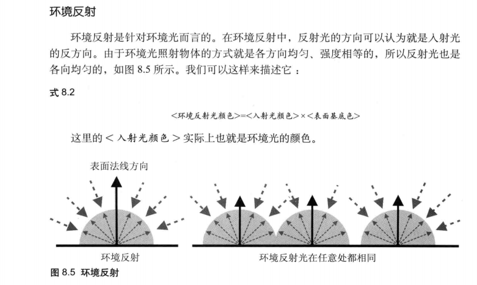
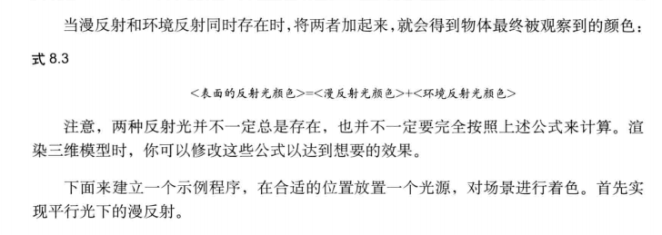

这篇笔记记录这我学习《WebGL编程指南》这本书的精简笔记。

## 02

绘制一个点的最简流程：

1. 定义顶点着色器和片元着色器。在这两个着色器中都有各自的定义好的内部变量。
2. 定义和获取容器 canvas 和 WebGL 上下文实例 gl。
3. 初始化顶点着色器和片元着色器。
4. 得到某个 attribute 变量（地址），例如 a_position ，并为它赋值。
5. 设置 gl 的背景色并 clear 。
6. 最后，gl 绘制这个点。

WebGL 依赖一种着色器的绘制机制。

着色器：

顶点着色器、片元着色器

将位置信息从 JavaScript 传递到 顶点着色器： attribute 变量

将颜色信息从 JavaScript 传递到 片元着色器： uniform 变量

## 04

缓冲区对象

WebGL提供了一种很方便的机制，即缓冲区对象(buffer object)，它可以一次性地向着色器传入多个顶点的数据。缓冲区对象是 WebGL系统中的一块内存区域，我们可以一次性地向缓冲区对象中填充大量的顶点数据，然后将这些数据保存在其中，供顶点着色器使用。

注意，开启attribute 变量后,你就不能再用 `gl.vertexAttrib[1234]f()`向它传数据了。除非你显式地关闭该 attribute 变量。实际上，你无法 (也不应该) 同时使用 `gl.vertexAttribPointer()` 和 `gl.vertexAttrib[1234]f()` 这两个函数。

WebGL 可以绘制的基本图像如下，借助API `gl.drawArrays()` 绘制。

但是，这个最简单的例子中数据在第四步中的赋值可是大有文章。数据如何动态的赋给 a_position 是需要一些步骤的。需要借助缓冲区对象，流程如下：

1. 准备一个 JavaScript 特殊数组。
2. 创建缓冲区对象，`gl.createBuffer()`。
3. 绑定缓冲区对象   `gl.bindBuffer(target, buffer)`。
4. 向缓冲区对象写入 准备好的 JavaScript 数据   `gl.bufferData(raeget, data, usage)`。
5. 将缓冲区对象分配给 attribute 变量   `gl.vertexAttribPointer(location, size, type, normalized, stride, offset)`。
6. 开启 attribute 变量   `gl.enbaleVertexAttribArray(location)`。

目前可以想到，我们可以控制第一步和第四步来达到数据的动态赋值。

仔细观察 将绑定到gl.ARRAY_BUFFER的缓冲区对象分配给指定attribute变量 这个函数

移动旋转缩放

**一个模型可能经过了多次变换，将这些变换全部复合成一个等效的变换，就得到了模型变换，模型变换的矩阵称为模型矩阵。上式中（旋转矩阵\*平移矩阵）就称为模型矩阵**

上图的情况不太理解。破案了，是 cuon-matrix.js 工具函数的锅，似乎不能叠加变换，以求得模型矩阵 Model Matrix。

## 05颜色和纹理

### 1 非坐标数据传入顶点着色器

### 2 几何形状的显示之varying 变量的作用 （由绘制彩色三角形例子引出）

🏷️顶点着色器和片元着色器之间图形装配与光栅化的过程如下：

`gl.drawArrays()`的参数n为3，顶点着色器将被执行3次。

第1步:执行顶点着色器。缓冲区对象中的第1个坐标 `(0.0,0.5)` 被传递给attribute，一旦一个顶点的坐标被赋值给了 `gl_Position`，它就进变量 `a_Position`。人了图形装配区域，并暂时储存在那里。你应该还记得，我们仅仅显式地向 `a_Position` 赋了x分量和y分量，所以Z分量和w分量赋的是默认值进入图形装配区域的坐标其实是 `(0.0,0.5,0.0,1.0)`。

第2步:再次执行顶点着色器。类似地，将第2个坐标 `(-0.5,-0.5,0.0,1.0)` 传入并储存在装配区。

第3步:第3 次执行顶点着色器。将第3个坐标`(0.5,0.5.0,1.0)`传入并储存在装配区。现在，顶点着色器执行完毕，三个顶点坐标都已经处在装配区了。

第4步:开始装配图形。使用传入的点坐标，根据gldrawArrays(的第一个参数信息(g1.TRIANGLES)来决定如何装配。本例使用三个顶点来装配出一个三角形。

第 5步:显示在屏幕上的三角形是由片元(像素) 组成的，所以还需要将图形转化为片元，这个过程被称为光栅化(rasterization)。光栅化之后，我们就得到了组成这个三角形的所有片元。在图 5.11 中的最后一步，你可以看到光栅化后得到的组成三角形的片元。

🏷️执行片元着色器

一旦光栅化过程结束后，程序就开始逐片元调用片元着色器。在图 5.12 中，片元着色器被调用了 10次每调用一次,就处理一个片元(为了整洁,图5.12 省略了中间步骤)对于每个片元，片元着色器计算出该片元的颜色，并写入颜色缓冲区。直到第15 步最后一个片元被处理完成，浏览器就会显示出最终的结果。

小知识：

| 类型和变量名      | 描述                                                         |
| ----------------- | ------------------------------------------------------------ |
| vec4 gl_FragCoord | 该内置变量的第1个和第2个分量表示片元在 < canvas >坐标系统(窗口坐标系统)中的坐标值 |

varying 变量

从上面了解到顶点着色器和片元着色器之间的数据传输细节，这也是 varying 变量起作用的地方。内插过程就是顶点着色器输出的值和片段着色器接收到的值之间的插值过程，在这个具体的例子中就是线段上的所有片元的颜色会被恰当的计算出来。

### 3 纹理映射

纹理映射（贴图）：一门重要的技术，①不想使用varying内插，为每个片元涂上合适的颜色 ②模拟坑坑洼洼的表面

四大步骤

1. 准备好映射到几何图形上的纹理图像
2. 为几何图形配置纹理映射方式。
3. 加载纹理图像，对其进行一些配置，以在WebGL 中使用它。
4. 在片元着色器中将相应的纹素从纹理中抽取出来，并将纹素的颜色赋给片元。

纹理图像（纹理，texture image）：纹理映射是所需的图片资源

纹素（texels，texture elements）：组成纹理图像的像素

纹理映射方式：`确定“几何图形的某个片元”的颜色怎样 `取决于 `“几何图形的某个图像中哪个(或哪几个)像素”`的问题(即片元与纹素的映射公式或关系)。

纹理坐标（texture coordinate）：一套新的坐标系统，用来确定图像的哪部分将覆盖到几何图形上。

📌**注意过程：**

1. 跨域问题：**处于安全性，WebGL 不允许使用跨域纹理图像。在这个示例中可以使用 live server 插件来创建一个轻量级的本地服务器，粗糙的理解为根目录下的文件都是同域的。**
2. 图像反转：该方法对图像进行了Y轴反转。WebGL 纹理坐标系统中的 t 轴的方向和 PNG、BMP、IPG等格式图片的坐标系统的 Y 轴方向是相反的。因此，只有先将图像Y轴进行反转，才能够正确地将图像映射到图形上。(或者，你也可以在着色器中手动反转t轴坐标。)
3. 纹理单元激活：WebGL通过一种称作**纹理单元**(texture unit)的机制来同时使用多个纹理。每个纹理单元有一个单元编号来管理一张纹理图像。即使你的程序只需要使用一张纹理图像，也得为其指定一个纹理单元。系统支持的纹理单元个数取决于硬件和浏览器的WebGL实现，但是在默认情况下，WebGL至少支持8个纹理单元，一些其他的系统支持的个数更多。内置的变量`gl.TEXTRUE0、gl.TEXTURE1……gl.TEXTURE7`各表示一个纹理单元。

​			

4. 绑定纹理对象到目标上。和缓冲区很像。

​		

4. 配置纹理对象参数。设置纹理图像映射到图形上的具体方式：如何根据纹理坐标获取纹素颜色、按哪种方式重复填充纹理。我们使用通用函数 `gl.texParameteri()` 来设置这些参数。不调用即使用默认值。**可以仔细研究一下这些参数背后的原理。**

​	

5. 纹理图像分配给纹理对象。

   

6. 将纹理单元传递给片元着色器
7. 从顶点着色器向片元着色器传输纹理坐标
8. 从片元着色器上获取纹理像素颜色

## 07 进入三维世界

从这里开始，将真正进入Web3D的世界，你将一点一点在浏览器中写出属于你自己的三维物体并控制它。这一步至关重要。

二维物体：考虑顶点的 x，y 坐标

三维物体：顶点xy轴坐标和深度信息（z轴）

MVP：模型视图投影矩阵：投影矩阵 * 视图矩阵 * 模型矩阵

①**视点、视线（观察点）、上方向：** 三要素确定目标在相机的视图中的位置。

*在本书中，淡化了求解视图矩阵的数学过程，直接给出接口 cuon-matrix.js 中的 setLookAt( )*

②**等价行为：** 移动视点和移动被观察对象等效。

③**相机与物体同时移动：** <“从视点看上去”的旋转后顶点坐标 > = <视图矩阵> * <模型矩阵> * <原始顶点坐标>      																										  = <模型视图矩阵> * <原始顶点坐标>

④**可视范围：** 通过键盘控制视点移动后可以发现一个问题，三角形会缺一个角，无法全部画出来。这时引出概念，可视范围，这是降低程序开销的手段，也是模拟人类观察物体的方式。只绘制可视范围内的物体。

⑤**可视空间：** 由可视空间接续引出的概念，数学矩阵表达的可视空间叫做**投影矩阵**，分为两种

- 长方体可视空间，也称盒状空间，由正射投影(orthographic projection)产生。建筑平面图常用。
- 四棱锥/金字塔可视空间，由透视投影(perspective projection)产生。有深度感更自然。

⑥**规范立方体：** 透视投影矩阵实际上将金字塔状的可视空间变换为了盒状的可视空间,这个盒状的可视空间又称规范立方体(Canonical View Volume)。

⑦**模型视图投影矩阵（MVP）：** 模型视图投影矩阵：投影矩阵 * 视图矩阵 * 模型矩阵。作用：模型矩阵将顶点从 *局部坐标系* 转化到 *世界坐标系* 中，视图矩阵将顶点从世界坐标系转化到 *视图坐标系* 下，而投影矩阵将顶点从视图坐标系转化到 *规范立方体* 中。

⑧**隐藏面消除：**为了解决一个问题：默认情况下按照缓冲区中的顺序绘制图形导致远处的物体挡住近处物体的问题，WebGL提供了隐藏面消除(hidden surface removal)功能。这个功能会帮助我们消除那些被遮挡的表面(隐藏面)，你可以放心地绘制场景而不必顾及各物体在缓冲区中的顺序,因为那些远处的物体会自动被近处的物体挡住,不会被绘制出来这个功能已经内嵌在WebGL中了，你只需要简单地开启这个功能就可以了。

应当注意的是，隐藏面消除的前提是正确设置可视空间,否则就可能产生错误的结果。不管是盒状的正射投影空间，还是金字塔状的透视投影空间，你必须使用一个。

⑨**深度缓冲区：** 帮助 WebGL 进行隐藏面消除。需要有视图投影矩阵的变换。

⑩**深度冲突：** 隐藏面消除是 WebGL的一项复杂而又强大的特性，在绝大多数情况下，它都能很好地完成任务。然而，当几何图形或物体的两个表面极为接近时，就会出现新的问题，使得表面看上去斑斑驳驳的。这种现象被称为深度冲突(Z-fighting)。之所以会产生深度冲突，是因为两个表面过于接近，深度缓冲区有限的精度已经不能区分哪个在前，哪个在后了。严格地说，如果创建三维模型阶段就对顶点的深度值加以注意，是能够避免深度冲突的。但是，当场景中有多个运动着的物体时，实现这一点几乎是不可能的。**导致深度冲突的原因：**略，解决深度冲突的方法：略。

⑪**多角形偏移：**WebGL提供一种被称为多边形偏移(polygon offset)的机制来解决深度冲突问题。该机制将自动在Z值加上一个偏移量，偏移量的值由物体表面相对于观察者视线的角度来确定。

### 画一个五彩的立方体

向缓冲区写入顶点坐标、颜色和索引。索引数组 `indices` 以索引值的形式存储了顶点的绘制顺序。索引值是整型数，所以数组的类型是 uint8Array (无符号8位整型数)。如果有超过256个顶点，那么就应该使用Uint16Array。通常我们不需要手动创建这些顶点和索引数据，因为三维建模工具(将第10章介绍)会帮助我们创建它们。gl.ELEMENT_ARRAY_BUFFER相关联的是顶点索引，gl.ARRAY_BUFFER关联的是顶点坐标和颜色。

我们也可以用类似的方法为立方体贴上不同的纹理。

## 08 光照

现实世界中的物体被光线照射时，会反射一部分光。只有当反射光线进入你的眼睛时，你才能够看到物体并辩认出它的颜色。比如，白色的盒子会反射白光，当白光进入你的眼睛时，你才能看到盒子是白色的。在现实世界中，当光线照射到物体上时，发生了两个重要的现象：①根据光源和光线方向，物体不同表面的明暗程度变得不一致根据光源和光线方向。②物体向地面投下了影子。

**着色：**shading 的真正含义就是，根据光照条件重建 “ **物体各表面明暗不一的效果** ” 的过程。

**阴影：** 物体向地面投下影子的现象，又被称为 shadowing 。

[^着色]: 对三维图形学来说，“着色”是如此重要，我们一直使用的 GLSL ES 就是“着色器”语言(OpenGL ES 着色器语言)。着色器最初被发明出来就是为了重建光照产生的明暗现象 (虽然现在它有了更多、更强大的功能)。

对于着色需要考虑两点：

- 发出光线的光源的类型
- 物体表面如何反射光线

光源类型：*平行光、点光源光*、环境光。

反射类型：*漫反射*、环境反射。

## 09 层次模型

