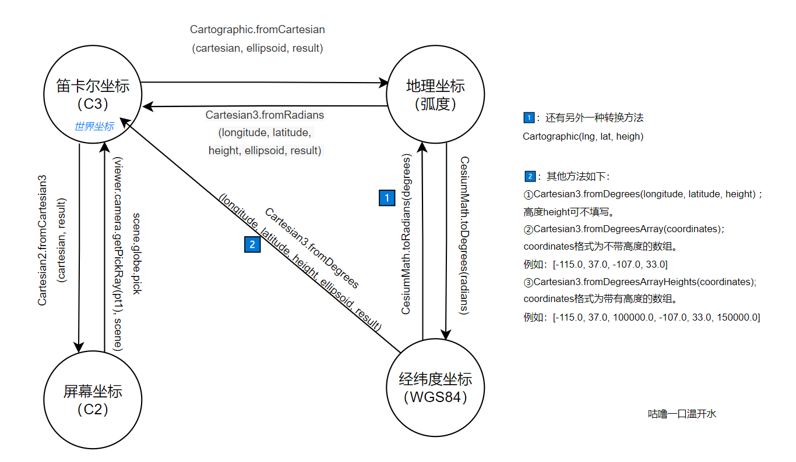

## 简单说说Cesium中的坐标

### 屏幕坐标（像素）

API： `new Cesium.Cartesian2(x,y)`

二维笛卡尔平面坐标，可通过`new Cesium.Cartesian2(x,y)`创建。

类似于： *Pt* *{x: 100, y: 100}*


### 笛卡尔空间直角坐标（三维直角坐标系）

API：  `new Cesium.Cartesian3(x,y,z)` 

又称世界坐标，可通过 `new Cesium.Cartesian3(x,y,z)` 创建,它的坐标原点在椭球的中心。我们在计算机上进行绘图时，不方便使用经纬度直接进行绘图，一般会将坐标系转换为笛卡尔坐标系，使用计算机图形学中的矩阵等进行绘图。

类似于：  tt {x: -2510495.02336417, y: 4814390.574430895, z: 3335462.6026715958}


### 地理坐标（弧度）
API：`new Cesium.Cartographic(longitude,latitude,height)`。

World Geodetic System 1984，是为GPS全球定位系统使用而建立的坐标系统，坐标原点为地球质心，其地心空间直角坐标系的Z轴指向BIH （国际时间服务机构）1984.O定义的协议地球极（CTP)方向，X轴指向BIH 1984.0的零子午面和CTP赤道的交点，Y轴与Z轴、X轴垂直构成右手坐标系。我们平常手机上的指南针显示的经纬度就是这个坐标系下当前的坐标，进度范围[-180，180],纬度范围[-90，90]。
我们都知道Cesium目前支持两种坐标系WGS84和WebMercator，但是在Cesium中没有实际的对象来描述WGS84坐标，都是**以弧度的方式来进行运用**的也就是Cartographic类：`new Cesium.Cartographic(longitude, latitude, height)`。


### 经纬度坐标（默认是WGS84坐标系）

API： 无

测绘中的地理经纬度坐标，默认是WGS84坐标系，坐标原点在球的质心。World Geodetic System 1984，是为GPS全球定位系统使用而建立的坐标系统，坐标原点为地球质心，其地心空间直角坐标系的Z轴指向BIH （国际时间服务机构）1984.O定义的协议地球极（CTP)方向，X轴指向BIH 1984.0的零子午面和CTP赤道的交点，Y轴与Z轴、X轴垂直构成右手坐标系。我们平常手机上的指南针显示的经纬度就是这个坐标系下当前的坐标，进度范围[-180，180],纬度范围[-90，90]。
**我们都知道Cesium目前支持两种坐标系WGS84和WebMercator**，🌟**但是在Cesium中没有实际的对象来描述WGS84坐标**，都是以弧度的方式来进行运用的也就是Cartographic类：`new Cesium.Cartographic(longitude, latitude, height)` 。

规则：

经度:参考球面上某点的大地子午面与本初子午面间的两面角，东正西负。
纬度:参考球面上某点的法线与赤道平面的夹角，北正南负。

注意：Cesuim中没有具体的经纬度对象，要得到经纬度首先需要计算为弧度，再进行转换.


### 4D笛卡尔坐标系（Cartesian4）

API：   `new Cesium.Cartesian4(x,y,z,,w)` 

暂未使用过。


## 转换

| 列：原坐标<br />行：目标坐标 | 笛卡尔空间直角坐标                                           | 地理坐标（弧度）                                             | 经纬度坐标（WGS84）                 | 屏幕坐标（像素）                                   |
| ---------------------------- | ------------------------------------------------------------ | ------------------------------------------------------------ | ----------------------------------- | -------------------------------------------------- |
| 笛卡尔空间直角坐标           | /                                                            | Cartographic.fromCartesian<br />(cartesian, ellipsoid, result) | 可转                                | Cartesian2.fromCartesian3<br />(cartesian, result) |
| 地理坐标（弧度）             | Cartesian3.fromRadians<br />(longitude, latitude, height, ellipsoid, result) | /                                                            | CesiumMath.<br />toDegrees(radians) | 可转                                               |
| 经纬度坐标（WGS84）          | Cartesian3.fromDegrees<br />(longitude, latitude, height, ellipsoid, result) | Cartographic.fromDegrees<br />(longitude, latitude, height, result)<br />或者Math.toRadians(degrees) | /                                   | 可转                                               |
| 屏幕坐标（像素）             | scene.globe.pick(viewer.camera.getPickRay(pt1), scene)       | 可转                                                         | 可转                                | /                                                  |


🎉下图是我绘制的转换图，使用原生Cesium提供的接口，有一些路线需要曲折一些：




作者：咕噜一口温开水

链接：https://github.com/githubli1123/CesiumExampleCollection

来源：GitHub

转载请注明出处。


## 其他博客的解析

在我们开始学习Entity之前，我们首先需要先学习下Cesium中的坐标系，Cesium中有多个坐标系，在进行添加Entity时经常会使用到。

## **坐标系介绍**

我们先来列举下Cesium中的坐标系：WGS84经纬度坐标系（没有实际的对象）、WGS84弧度坐标系（Cartographic）、笛卡尔空间直角坐标系（Cartesian3）、平面坐标系（Cartesian2），4D笛卡尔坐标系（Cartesian4）

### 1、WGS84坐标系

World Geodetic System 1984，是为GPS全球定位系统使用而建立的坐标系统，坐标原点为地球质心，其地心空间直角坐标系的Z轴指向BIH （国际时间服务机构）1984.O定义的协议地球极（CTP)方向，X轴指向BIH 1984.0的零子午面和CTP赤道的交点，Y轴与Z轴、X轴垂直构成右手坐标系。我们平常手机上的指南针显示的经纬度就是这个坐标系下当前的坐标，进度范围[-180，180],纬度范围[-90，90]。
我们都知道Cesium目前支持两种坐标系WGS84和WebMercator，但是在Cesium中没有实际的对象来描述WGS84坐标，都是以弧度的方式来进行运用的也就是Cartographic类：new Cesium.Cartographic(longitude, latitude, height)，这里的参数也叫longitude、latitude，就是经度和纬度，计算方法：弧度= π/180×经纬度角度。


WGS84坐标系

### 2、笛卡尔空间直角坐标系（Cartesian3）

笛卡尔空间坐标的原点就是椭球的中心，我们在计算机上进行绘图时，不方便使用经纬度直接进行绘图，一般会将坐标系转换为笛卡尔坐标系，使用计算机图形学中的知识进行绘图。这里的Cartesian3，有点类似于SuperMap iObejcts中的Point3D对象，new Cesium.Cartesian3(x, y, z)，里面三个分量xyz。

 


笛卡尔空间直角坐标系

### 3、平面坐标系（Cartesian2）

平面坐标系也就是平面直角坐标系，是一个二维笛卡尔坐标系，与Cartesian3相比少了一个z的分量，new Cesium.Cartesian2(x, y)。Cartesian2经常用来描述屏幕坐标系，比如鼠标在电脑屏幕上的点击位置，返回的就是Cartesian2，返回了鼠标点击位置的xy像素点分量。


 


平面坐标系

### 4、4D笛卡尔坐标系（Cartesian4）

到目前来说，还没有用过，等后续有用到的时候再更新吧

## 几种坐标系详细方法

### 1、经纬度和弧度的转换

**经纬度转弧度：**var radians=Cesium.CesiumMath.toRadians（degrees）;
**弧度转经纬度：**var degrees=Cesium.CesiumMath.toDegrees（radians）;
我们来看下Cesium中源码的转换方法，其实就是：弧度= π/180×经纬度角度；经纬度角度=180/π×弧度。

```javascript
CesiumMath.RADIANS_PER_DEGREE = Math.PI / 180.0;
CesiumMath.DEGREES_PER_RADIAN = 180.0 / Math.PI;
CesiumMath.toRadians = function(degrees) {
        //>>includeStart('debug', pragmas.debug);
        if (!defined(degrees)) {
            throw new DeveloperError('degrees is required.');
        }
        //>>includeEnd('debug');
        return degrees * CesiumMath.RADIANS_PER_DEGREE;
    };
CesiumMath.toDegrees = function(radians) {
        //>>includeStart('debug', pragmas.debug);
        if (!defined(radians)) {
            throw new DeveloperError('radians is required.');
        }
        //>>includeEnd('debug');
        return radians * CesiumMath.DEGREES_PER_RADIAN;
    };
```

### 2、 **WGS84经纬度坐标和WGS84弧度坐标系（Cartographic）的转换**

**1.直接转换：**通过上面提到的方法，将经纬度转换为弧度后，直接new Cesium.Cartographic(longitude弧度, latitude弧度, height米)
**2.间接转换：**通过var cartographic= Cesium.Cartographic.fromDegrees(longitude, latitude, height）直接转换；
类似的还有var cartographic= Cesium.Cartographic.fromRadians(longitude, latitude, height）方法，传入的是弧度。

### 3、WGS84坐标系和笛卡尔空间直角坐标系（Cartesian3）的转换

**WGS84转为笛卡尔空间直角坐标系**
**1.通过经纬度或弧度进行转换：**
var c3= Cesium.Cartesian3.fromDegrees(longitude, latitude, height) ；高度height可不填写。
var c3s=Cesium.Cartesian3.fromDegreesArray(coordinates)；coordinates格式为不带高度的数组。例如：[-115.0, 37.0, -107.0, 33.0]
var c3s=Cesium.Cartesian3.fromDegreesArrayHeights(coordinates);coordinates格式为带有高度的数组。例如：[-115.0, 37.0, 100000.0, -107.0, 33.0, 150000.0]
同理将度转化为弧度，然后再进行转换，
和上面一样有Cesium.Cartesian3.fromRadians，Cesium.Cartesian3.fromRadiansArray，Cesium.Cartesian3.fromRadiansArrayHeights等方法，用法和上面一样，只是度需要转换为弧度，这里不再讲这些方法。

其实fromDegrees内部也是用的fromRadians方法，这点大家可以了解下，另外WGS84坐标系转笛卡尔空间直角坐标系代码如下，大家可以了解下转换过程：

```javascript
Cartesian3.fromRadians = function(longitude, latitude, height, ellipsoid, result) {
        //>>includeStart('debug', pragmas.debug);
        Check.typeOf.number('longitude', longitude);
        Check.typeOf.number('latitude', latitude);
        //>>includeEnd('debug');

        height = defaultValue(height, 0.0);
        var radiiSquared = defined(ellipsoid) ? ellipsoid.radiiSquared : wgs84RadiiSquared;

        var cosLatitude = Math.cos(latitude);
        scratchN.x = cosLatitude * Math.cos(longitude);
        scratchN.y = cosLatitude * Math.sin(longitude);
        scratchN.z = Math.sin(latitude);
        scratchN = Cartesian3.normalize(scratchN, scratchN);

        Cartesian3.multiplyComponents(radiiSquared, scratchN, scratchK);
        var gamma = Math.sqrt(Cartesian3.dot(scratchN, scratchK));
        scratchK = Cartesian3.divideByScalar(scratchK, gamma, scratchK);
        scratchN = Cartesian3.multiplyByScalar(scratchN, height, scratchN);

        if (!defined(result)) {
            result = new Cartesian3();
        }
        return Cartesian3.add(scratchK, scratchN, result);
    };
```

**2.通过度来进行转换**
var position = Cesium.Cartographic.fromDegrees(longitude, latitude, height）;
var c3 = Cesium.Ellipsoid.WGS84.cartographicToCartesian(position);
var c3s=Cesium.Ellipsoid.WGS84.cartographicArrayToCartesianArray([position1,position2,position3])
弧度同理
**笛卡尔空间直角坐标系转换为WGS84**
1.直接转换
var cartographic= Cesium.Cartographic.fromCartesian(cartesian3)
转换得到WGS84弧度坐标系后再使用经纬度和弧度的转换，进行转换到目标值
2、间接转换
var cartographic= Cesium.Ellipsoid.WGS84.cartesianToCartographic(cartesian3)
var cartographics= Cesium.Ellipsoid.WGS84.cartesianArrayToCartographicArray([cartesian1,cartesian2,cartesian3])

### 4、平面坐标系（Cartesian2）和笛卡尔空间直角坐标系（Cartesian3）的转换

**平面坐标系转笛卡尔空间直角坐标系**
这里需要说明的是当前的点必须在三维球上，否则返回的是undefined，我们在ScreenSpaceEventHandler回调会取到的坐标都是Cartesian2，大家可以测试观察下。
1.屏幕坐标转场景WGS84坐标，这里的场景坐标是包含了地形、倾斜、模型的坐标。
转换方法为：var cartesian3= viewer.scene.pickPosition(Cartesian2)，目前IE浏览器不支持深度拾取，所以用不了这个方法。
2.屏幕坐标转地表坐标，这里是地球表面的WGS84坐标，包含地形，不包括模型、倾斜摄影表面。
转换方法为：var cartesian3= viewer.scene.globe.pick(viewer.camera.getPickRay(Cartesian2),viewer.scene);
3.屏幕坐标转椭球面坐标，这里的椭球面坐标是参考椭球的WGS84坐标，不包含地形、模型、倾斜摄影表面。
转换方法为：var cartesian3= viewer.scene.camera.pickEllipsoid(Cartesian2)
**笛卡尔空间直角坐标系转平面坐标系**
var cartesian2= Cesium.SceneTransforms.wgs84ToWindowCoordinates(viewer.scene,cartesian3)


作者：为梦齐舞
链接：https://www.jianshu.com/p/ed4bb38db9a4
来源：简书
简书著作权归作者所有，任何形式的转载都请联系作者获得授权并注明出处。